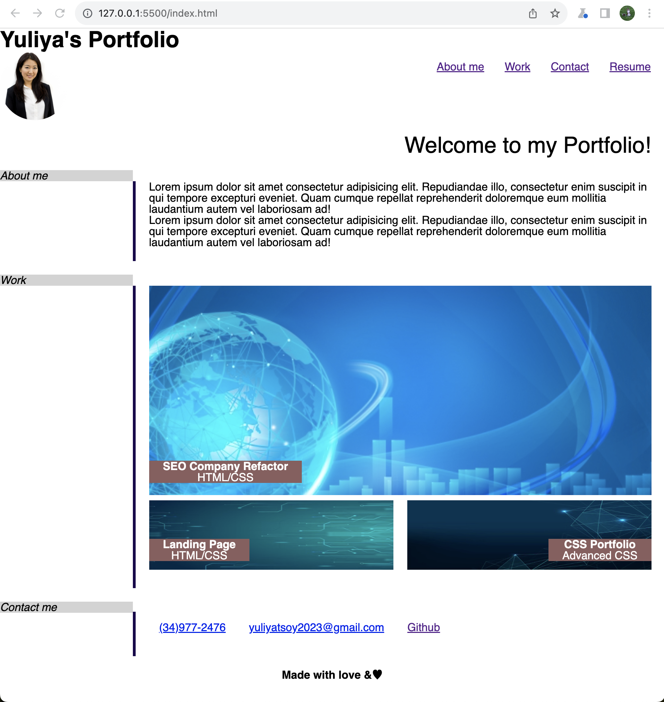

# CSS Portfolio

This website contains information about Bootcamp student Yuliya Tsoy:

- section with a short bio paragraph
- section with work that has been done so far: project "Seo Company Refactor", "Landing Page" and "SCC Portfolio"
- section with direct phone number, email address and GitHub link to Yuliya's Profile

## The main goal creating this project

To apply advanced css abilities and showcase previous projects for potential employers.

## Cool features of this Portfolio:

- There is my name, a recent avatar, and links to sections about me, my work, and how to contact me
- When you click one of the links in the navigation the UI scrolls to the corresponding section. I applied smooth scroling feature as well.
- First application image is larger than the others
- When you click on the images of the applications you are taken to that deployed application
- When you resize the page or view the site on various screens and devices you are presented with a responsive layout that adapts to your viewport

## Deployed Link with Live version is here:

https://yuliyatsoy.github.io/css-portfolio/

## Screenshot of the application:

